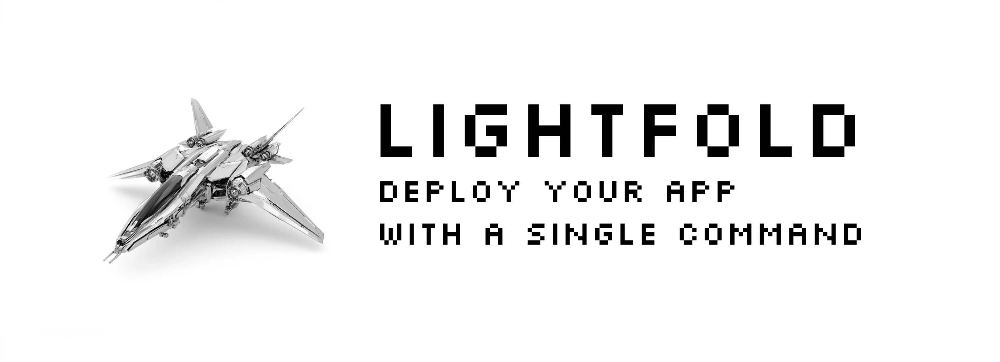

<p align="center">
  
</p>

<p align="center">
  <a href="https://github.com/theognis1002/lightfold-cli/releases/latest">
    
  </a>
  <a href="https://github.com/theognis1002/lightfold-cli/blob/main/LICENSE">
    
  </a>
  <a href="https://github.com/theognis1002/lightfold-cli/stargazers">
    
  </a>
  <!-- <a href="https://formulae.brew.sh/formula/lightfold">
    
  </a> -->
</p>

Deploy any web app to your favorite cloud provider with a single command. No Docker, no YAML, no hassle.

## Quick Start

```bash
# Install
brew tap theognis1002/lightfold
brew install lightfold

# Deploy your app
cd your-project
lightfold deploy
```

That's it! Lightfold will:
- Auto-detect your framework (Next.js, Django, Rails, etc.)
- Set up a server on your preferred cloud (DigitalOcean, Vultr, etc.)
- Deploy your app with zero configuration

## Features

- **Works With Your Stack**: Supports 15+ frameworks including Next.js, Astro, Django, Rails, Laravel
- **Deploy Anywhere**: DigitalOcean, Vultr, Hetzner Cloud, or bring your own server
- **Zero Config**: Automatic framework detection and server setup
- **Smart Deploys**: Only deploys what changed, skips everything else

## Installation

### Homebrew (macOS/Linux)

```bash
brew tap theognis1002/lightfold
brew install lightfold
```

### Manual Installation

**Download Pre-built Binary:**
Visit the [releases page](https://github.com/theognis1002/lightfold-cli/releases) and download the binary for your platform.

**Build from Source:**
```bash
git clone https://github.com/theognis1002/lightfold-cli.git
cd lightfold-cli
make build
sudo make install
```

## Commands

### Primary Command

**`lightfold deploy`** - Full deployment (recommended)

### Advanced Commands

For granular control over deployment steps:

- **`lightfold create`** - Create infrastructure only
- **`lightfold configure`** - Configure server only
- **`lightfold push`** - Deploy code changes only

### Management Commands

- **`lightfold status`** - View deployment status
- **`lightfold logs`** - View application logs
- **`lightfold rollback`** - Rollback to previous release
- **`lightfold sync`** - Sync local state with current config
- **`lightfold ssh`** - SSH into deployment target
- **`lightfold destroy`** - Destroy VM and remove local config

## Configuration

### Target-Based Config

Config stored in `~/.lightfold/config.json`:

```json
{
  "targets": {
    "myapp-prod": {
      "project_path": "/path/to/project",
      "framework": "Next.js",
      "provider": "digitalocean",
      "builder": "nixpacks",
      "provider_config": {
        "digitalocean": {
          "ip": "192.168.1.100",
          "ssh_key": "~/.ssh/id_rsa",
          "username": "deploy",
          "region": "nyc1",
          "size": "s-1vcpu-1gb",
          "provisioned": true,
          "droplet_id": "123456789"
        }
      }
    }
  }
}
```

### API Tokens

Tokens stored locally in `~/.lightfold/tokens.json`:

```json
{
  "digitalocean": "dop_v1_...",
  "vultr": "...",
  "hetzner": "..."
}
```

### State Tracking

State per target in `~/.lightfold/state/<target>.json`:

```json
{
  "created": true,
  "configured": true,
  "last_commit": "abc123...",
  "last_deploy": "2025-10-03T10:30:00Z",
  "last_release": "20251003103000",
  "provisioned_id": "123456789",
  "builder": "nixpacks"
}
```

## Supported Frameworks

**Frontend**: Next.js, Astro, Gatsby, Svelte/SvelteKit, Vue.js, Angular
**Backend**: Django, Flask, FastAPI, Express.js, NestJS, tRPC, Laravel, Rails, Spring Boot, ASP.NET Core, Phoenix
**Languages**: JavaScript/TypeScript, Python, PHP, Ruby, Go, Java, C#, Elixir

## Supported Providers

### Available
- [**DigitalOcean**](https://www.digitalocean.com) - Full provisioning support
- [**Hetzner Cloud**](https://www.hetzner.com/cloud) - Full provisioning support
- [**Vultr**](https://www.vultr.com) - Full provisioning support
- **BYOS** (Bring Your Own Server) - Use any existing server

### Coming Soon
- [ ] [Linode](https://www.linode.com)
- [ ] [AWS EC2](https://aws.amazon.com/ec2)
- [ ] [Google Cloud](https://cloud.google.com/compute) (Compute Engine)
- [ ] [Azure](https://azure.microsoft.com/products/virtual-machines) (VMs)
- [ ] [Traefik](https://traefik.io) / [Caddy](https://caddyserver.com)

## Development

### Building Locally

```bash
make build && ./lightfold .
make test
```

See [AGENTS.md](AGENTS.md) for architecture details and [docs/RELEASING.md](docs/RELEASING.md) for release instructions.
